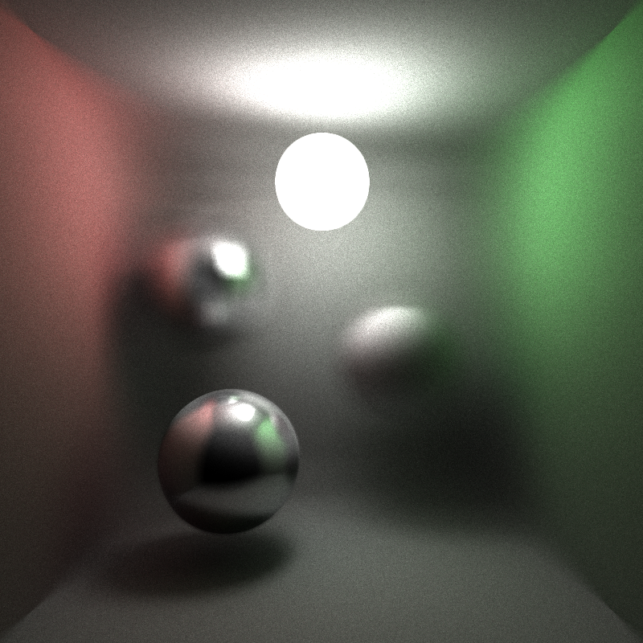
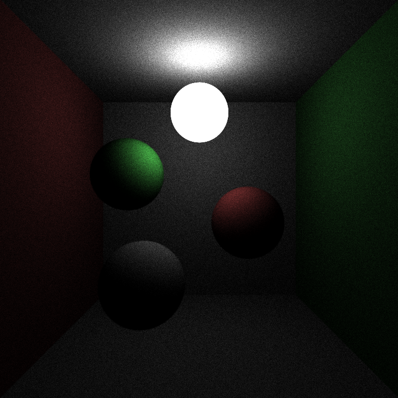
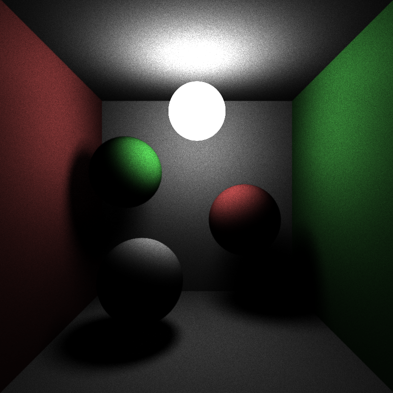

# Distributed-Renderer

**University of Pennsylvania, CIS 565: GPU Programming and Architecture, FINAL PROJECT**

#### Team : Dome Pongmongkol and Sanchit Garg

### Project outline

We have implemented a Distributed Renderer. The idea is divide the final image into parts, render parts on different systems and then accumulate the final image on one system. The rendering method being used on the back end is a CUDA based Multiple Importance Sampling (MIS) path tracer. TCP is used for communication between the viewer and the renderers.

### Slides

Project Proposal : 

Progress Report 1 :

Progress Report 2 :

Progress Report 3 :

## Modes
Our renderer has 3 modes as follows
Front End Viewer: This mode will send scene files (.txt/ .obj) to the leader to initialize the render. Please note that this mode runs on any machines that runs OpenGL (no CUDA card requires) To run in this mode, set argument as “f scene_file_dir scene_list”, while scene_file_dir is the path to the directory storing the scene files, and scene_list are the file listing every scene files that needs to be transferred to the leader node.
Renderer: This mode will initialize a renderer that will be in standby until it receives scene files and a command from the leader to render. It will periodically send the pixels it’s responsible for back to the Front End Viewer. To run in this mode, set argument as “r”.
Leader + Renderer: This mode will initialize both a Leader and a Renderer. The Leader will be responsible for receiving a render job from the Front End Viewer and distribute the work to the renderers. To run in this mode, set argument as “f”.
The user will have to manually type in the IP address of the running Renderer nodes while initializing the program in this mode.

## How the workload distribution works.
**Please note that this system assumes that the network environment is stable. It will tolerate minor packet loss (as it was built on top of TCP), but if it cannot connect to its receiver after trying for a certain amount of time, it will give up and exit.
**For more information about the packets/commands used. please see msg.proto (Google Protobuf Format)

Initiate rendering nodes (RN)
Initiate the leader node (LN), fetch in the IP address and port of the running rendering nodes.
Initiate the front end viewer (FV), fetch in the IP address and port of the leader node.
FV contacts LN asking if it’s available, if it is not in the middle of rendering, it will send back an ACK with the code OK, if not, it will also send back an ACK, but with the code NO
if the FV is given OK, it will proceed and send scene files to LN, if not, it will repeat step 4 again.
after LN receives scene files from FV, it will propagate these scene files to the renderers in its list and mark those as “active”. RN receives scene files and initialize itself.
LN will go through the active RN list and divide the work equally to all of them. For example, if there are 2 active RNs and 640,000 pixels, each of them will be responsible for rendering 320,000 each. it will also decides in every iterations the RN has to send back data to the FV
Rendering starts
Once a RN is done with rendering. It will stop, send a message to tell LN, and stay standby.

## Multiple Importance Sampling

This is a global illumination algorithm where for every ray, we sample both the BxDF and the light. Then using weights, add both the contributions.

For every ray, we intersect it with the scene. At this intersection point, we have to determine the color and the outgoing direction. To determine the color, we need to sample both the light and the surface BRDF. The bounce direction is given by the BRDF.
Once we get both the colors, we add them based on power heuristics. The method is explained in PBRT.

##### Light Importance Sampling

The first step of MIS is sampling based on the light. For this, we select a random point on any one of the light sources. Then we shoot a ray from our intersection point to the light. If the light is unobstructed, them we can calculate the LIS term and its PDF. It is important to note that we need to save the light which was sampled for future reference. This is called light importance sampling as we consider the color only if we can reach the sampled point of our light source.

Image below shows the render of the scene using just LIS.

As you can see the scene does not have a lot of information and is very dark. We can just get color for the point that can reach the light directly.

##### BRDF importance sampling

In this step, based on the material properties, we sample the bounce direction. For example, for lambertian surfaces, we select a random ray in the cosine weighted hemispherical direction. We try and intersect this ray with the same light that was sampled in LIS. If we can reach that light, then the BRDF sampling would contribute to the final color.

Here is a render using just BIS

##### MIS = BIS + LIS

The next step is to get the direct illumination effect for the renderer. This is adding the contributions from BIS and LIS steps and using power heuristics based weighting to add the colors. The PDF terms from both the steps is used for this weighting.

Here is a render with the direct illumination step of MIS.

##### Throughput and Indirect illumination

Now at every bounce depth of the ray, we have to find the contribution of that color calculated to the final pixel color. To do that, we use the concept of throughput. We basically start with 1 and at every step, reduce is by a factor calculated based on the BRDF’s pdf and the MIS color. This acts as the percentage contribution for the bounce depth.

For indirect illumination, we start with a color black and keep adding the contribution of every bounce depth. The bounce color is factored by its throughput.

##### Russian Roulette and Ray Termination

After a trace depth of 2, we check the throughput of every ray with a random float generated between 0 and 1. If the throughput is lower than that, the ray is terminated and the color is written to the image buffer. Other conditions for ray termination are if the ray escapes into the scene and does not intersect anything or a ray hits a light source.

Here is the final image with indirect illumination. 

## Performance Analysis
The major bottlenecks for this project is the network latency. So we need to find the optimal frequency of sending data (Too often = Slower, but the rendered image on the Front End Viewer is more up-to-date). Taking from Monte Carlo rendering, to get twice a better image, we need to render 4 times more samples. This would be used to decide the frequency of sending data.

## References
PBRT
Adam Mally’s Slides for CIS 450/560 Fall 2015

